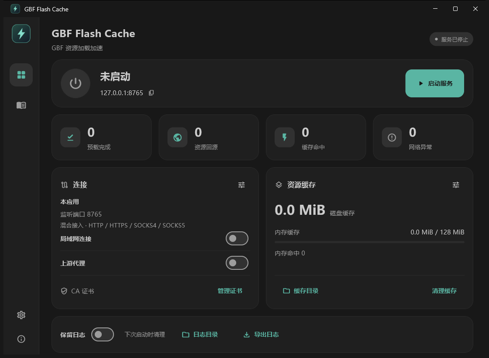
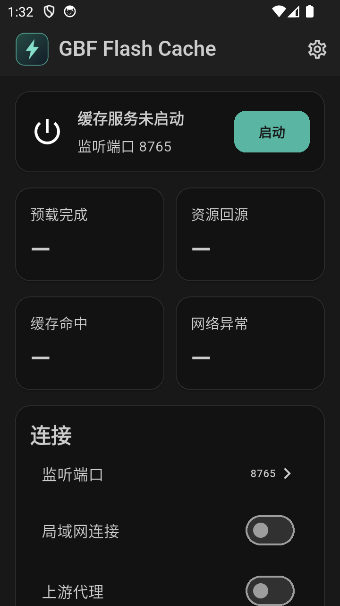
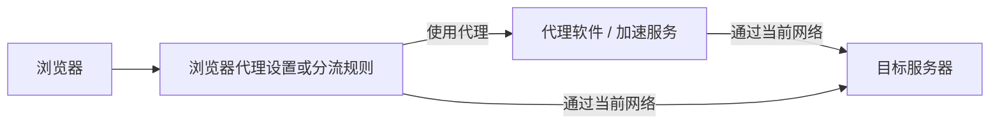
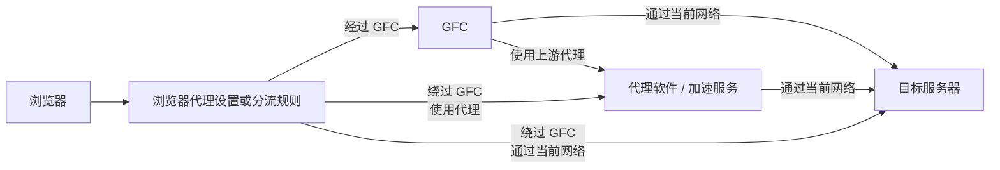
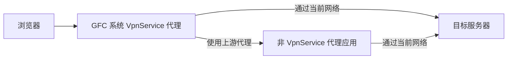

# GBF Flash Cache

GBF 资源加载加速工具，使用 Rust 共享核心和 Flutter 界面，支持 Windows 与 Android。提供本地资源缓存、实时预载及连接优化，不内置代理节点。

只缓存指定 CDN 范围内的静态资源；主站页面和游戏接口响应不缓存。使用方法和处理范围也可在应用内查看。

- [链路概览](#链路概览)：通用代理链路、GFC 接入与 Android 系统代理。
- [使用说明](#使用说明)：Windows、Android 操作、处理范围与链路行为。
- [构建与验证](docs/build.md)：开发环境、检查命令、打包与签名。
- [架构与边界](docs/architecture.md)：核心、应用层及平台职责。

## 应用界面

| Windows | Android |
| --- | --- |
|  |  |

## 链路概览

### ① 通用代理／加速链路

### ② 接入 GFC 后的通用链路

当前网络可能由其它软件的 TUN／VPN 模式或路由器加速服务接管。

### ③ GFC 占用 VpnService（Android 版本特性）

GFC 开启系统代理时，应用范围按上游代理的位置选择：

- **不使用上游代理，或使用其它设备／服务器上的代理**：可以选择“全部应用”，也可以按需选择部分应用。
- **使用同一台 Android 设备上的代理应用**：不能选择“全部应用”。应在 GFC 中选择“包含应用”，只包含需要处理的浏览器；或选择“排除应用”，将上游代理应用排除，避免流量回环导致网络不可用或设备卡顿。

GFC 占用 VpnService，本机上游代理应用只能提供代理端口，不能同时开启自身的 VpnService。

## 使用说明

### Windows 开始使用

1. 如需指定代理，启用“上游代理”，填写协议、地址和端口；用户名、密码按上游要求填写。
2. 在“管理证书”中安装本应用的 CA 证书。Firefox 使用独立证书库时，需将导出的公开 CA 证书导入浏览器。
3. 启动缓存服务；端口被占用时，在连接设置中修改监听端口。
4. 将浏览器代理指向 `127.0.0.1`，端口与本应用的监听端口一致。监听端口混合支持 HTTP、HTTPS 代理、SOCKS4、SOCKS5，无需在 GFC 选择入站协议。

当前版本不会修改 Windows 系统代理。未启用上游代理时，GFC 使用当前网络；当前网络仍可能由其它代理或路由处理。

需要配合按进程名识别的游戏加速器时，可启用[加速器兼容模式](#加速器兼容模式)。

### Android 开始使用

#### 浏览器配置代理

1. 在 CA 证书页面导出公开证书，在 Android 或浏览器中安装并信任。
2. 按需配置上游代理，启动缓存服务。
3. 在支持代理配置的浏览器或插件中，填写 `127.0.0.1` 和 GFC 的监听端口。

此方式不需要开启 GFC 的系统代理，可配合其它已接管网络的代理或加速器。浏览器必须支持代理配置并信任本应用的 CA。

#### 通过系统代理接入

1. 安装 CA 证书，并确认所用浏览器信任该证书。
2. 在“连接”中开启“系统代理”，进入系统代理设置选择应用范围。
3. 点击首页“启动”，按 Android 提示授权；点击“停止”结束服务。系统代理开关保存配置，不会单独立即启动服务。

| 应用范围 | 行为 |
| --- | --- |
| 全部应用 | 包含、排除名单均不生效 |
| 包含应用 | 仅接管包含名单中的应用；启动前至少选择一个 |
| 排除应用 | 接管排除名单以外的应用 |

两份名单独立保存，本应用始终绕过自身接管。

### 局域网连接

在运行 GFC 的设备上开启“局域网连接”。其它设备的浏览器填写 **GFC 所在设备的局域网 IP** 和监听端口，并安装同一张公开 CA 证书。默认关闭局域网连接；运行时切换会重启服务、中断当前连接。

### 连接检查与排查

正常打开几个游戏页面，观察资源回源、预载完成和缓存命中计数。浏览器自身缓存命中时，请求不会进入 GFC，计数不一定增加，无需为此清空浏览器缓存。

“运行中”只表示服务已启动；“检测连接”成功只表示此时 GFC 出站可用，不能单独证明浏览器已接入。

切换网络或加速器节点后，若连接持续异常，可尝试在应用内停止并重新启动服务，或完全退出应用后重新打开。

---

### 通用功能

连接和缓存设置自动保存，无需保存按钮；文本结束编辑或离开设置时校验保存，输入有误或保存失败会提示。主题可选择跟随系统、亮色或暗色。

### 缓存范围

**本应用仅缓存指定 GBF CDN 域名下，符合路径和文件类型规则的静态资源，并非所有经过本应用的资源都会缓存。**

以下 CDN 域名的 HTTPS 443 端口流量参与处理：

- `prd-game-a-gbf.akamaized.net` 及 a1～a5 分片。
- `prd-game-a-granbluefantasy.akamaized.net` 及 a1～a5 分片。
- `prd-game-a-granbluefantasy-steam.akamaized.net` 及 a1～a5 分片。
- `granbluefantasy.akamaized.net`、`gbf.akamaized.net`。

缓存范围限于 `/assets/`、`/assets_en/` 下符合规则的图片、JS、CSS、音频、字体、WebAssembly 和静态 JSON。这些域名下的其它请求不缓存。

以下两个主站域名的 HTTPS 443 端口请求会转发并进行连接优化，同时用于识别资源和场景；响应不缓存：

- `game.granbluefantasy.jp`
- `gbf.game.mbga.jp`

主站请求可以绕过本应用，但可能降低资源预载效果。

其它域名或端口的请求无需进入本应用；若进入，则仅转发，不解析、不缓存。其中 HTTPS 保持加密传输，例如 `ws.game.granbluefantasy.jp:11240`。

### 缓存统计

前三项仅统计上述 CDN 缓存范围内的资源：

- **预载完成**：本轮在浏览器请求前，后台提前下载并保存的资源数，不含已有缓存的读取。
- **资源回源**：本应用向 CDN 服务器发起资源请求的次数，包含后台预载。
- **缓存命中**：浏览器发来的资源请求，由本应用内存或磁盘缓存直接响应的次数。
- **网络异常**：本应用处理的 CDN 及两个主站域名请求发生网络错误或收到 HTTP 4xx/5xx 的次数，包含后台请求，但不计入后台预载返回的 404。

处理范围之外的域名请求，以及浏览器自身缓存直接响应的请求，不计入统计。

每次启动缓存服务或清理缓存时，四项计数归零。停止服务后保留本轮计数。各项可能重叠，不能直接相加。

### 日常使用

保留浏览器缓存即可。实时预载会提前下载可能用到的资源，也可能增加流量。

内存缓存默认 128 MiB，可调整，0 表示关闭；磁盘缓存不设容量上限。服务启动后，从磁盘恢复上次的内存资源，最多占内存上限的一半，不产生额外下载。连续 5 分钟未被实际请求的资源会退出内存，磁盘缓存保留；内存不足时会提前淘汰低热度资源。

### 链路行为

连接顺序：浏览器或应用 → GFC → 上游代理（可选）→ 服务器。

| 入站协议／方式 | 上游协议 | TCP 出站 | UDP 出站 |
| --- | --- | --- | --- |
| HTTP／HTTPS／SOCKS4 | 无 | 直接出站 | 入站不支持 |
| HTTP／HTTPS／SOCKS4 | HTTP／HTTPS／SOCKS4／SOCKS5 | 经上游 | 入站不支持 |
| SOCKS5／系统代理 | 无 | 直接出站 | 直接出站 |
| SOCKS5／系统代理 | HTTP／HTTPS／SOCKS4 | 经上游 | 直接出站 |
| SOCKS5／系统代理 | SOCKS5 | 经上游 | 经上游 |

“系统代理”仅指 Android 的该功能。配置经上游的流量在上游失败后不会自动改为直连；UDP 仅转发，不参与缓存。

### CA 证书与数据

重复安装保留同一张 CA；重新生成需停止服务并确认，之后所有使用旧 CA 的设备都需安装新证书。公开的 `gbf-flash-cache.cer` 可提供给接入设备；**不要分享包含 CA 私钥的应用数据**，私钥泄漏可能使他人伪造被已信任该 CA 的设备接受的证书。

| 项目 | Windows | Android |
| --- | --- | --- |
| 数据位置 | 程序旁 `data/`；缓存、日志目录可另选 | 应用私有、不备份的目录 |
| 上游密码保护 | 当前 Windows 账号加密 | Android Keystore |
| CA 安装与移除 | 应用可操作当前用户的证书信任；计算机级信任需管理员权限 | 交由系统或浏览器管理 |

Windows 停止服务后可更改缓存、日志目录，所选目录下会创建专用子目录；迁移复制资源并保留旧目录。更新前退出旧版，保留完整 `data/` 及自选目录。`data/ca/authority.json` 包含私钥，不可分享。

Android 卸载会删除配置、缓存及应用内 CA 私钥；系统中已安装的旧 CA 需另行管理。卸载重装后需要安装新 CA。

日志默认在下次启动应用时清理；勾选“保留日志”可保留，停止服务后可导出。

### 关闭应用

如未设置合适的分流规则，关闭应用或停止服务前，请取消浏览器指向本应用的代理。

---

### Windows 版本特性

#### 加速器兼容模式

在“设置”中开启，重启后以 `chrome.exe` 进程名运行，供按进程名识别的游戏加速器接管流量。默认关闭，关闭后重启恢复。

仍从 `GBF Flash Cache.exe` 启动，无需手动改名。两种模式共用配置、缓存和证书。

#### 窗口与启动

设置中提供开机启动、启动后自动开启缓存服务、启动时隐藏到托盘，三项默认关闭；关闭窗口时隐藏到托盘默认开启。

### Android 版本特性

#### 系统代理与本地上游

系统代理通过 Android VpnService 实现，不能与其它使用 VpnService 的代理或加速器同时运行。使用本地上游时，上游应用应仅提供代理端口，不启用 VpnService。

必须让上游应用绕过 GFC 的系统代理，避免上游出站流量再次进入本应用形成回环：

- 包含应用：不要包含上游应用。
- 排除应用：将上游应用排除。
- 不要选择“全部应用”。

错误配置可能导致网络无法访问或设备卡顿；请停止服务、调整名单后再启动。

使用安全 DNS 或 Android 私人 DNS 时，流量可能无法按域名进入缓存。系统代理不能绕过浏览器或其它应用的 CA 信任限制。

#### 后台运行

GFC 需要在使用浏览器期间保持后台运行。因系统省电或后台管理限制，切换到浏览器后可能出现加载缓慢、超时或无法访问。请在系统设置中允许 GFC 后台活动，必要时取消电池优化；使用本机上游时，也需检查上游应用的后台设置。

仅关闭界面不等于停止服务，可在应用或通知中停止。Android 不提供开机启动或启动后自动开启缓存服务。

## 源码结构

| 目录 | 内容 |
| --- | --- |
| `core/` | Rust 缓存、资源解析、实时预载调度、网络处理 |
| `app/` | Flutter 界面、应用原生模块、Windows 与 Android 宿主 |
| `scripts/` | 构建、打包、验证及第三方许可收集 |
| `docs/` | 构建与架构文档 |

## 许可证

原创代码采用 [MIT 许可证](LICENSE)。第三方组件遵循各自许可证，构建时收集并随包提供其声明。
